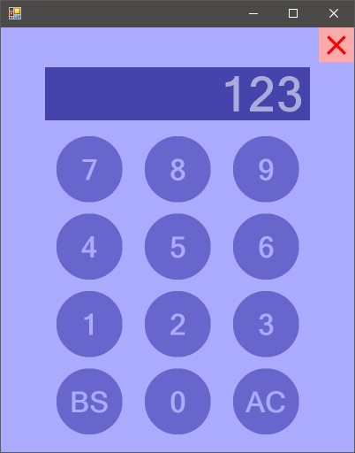

# NumPad

電卓風の数値入力をPowerShellで作ってみたくてまたしてもやらかしました。

## 画面イメージ



## つかいかた

### コンストラクタ

```powershell
# デフォルトのサイズでインスタンスを作成
$tp = New-Object NumPad

# 指定位置かつデフォルトのサイズでインスタンスを作成
$tp = New-Object NumPad(<int:左端位置>,<int:上端位置>)

# 指定位置とサイズでインスタンスを作成
$tp = New-Object NumPad(<int:左端位置>,<int:上端位置>,<int:幅>,<int:高さ>)
```

### プロパティ

| プロパティ名称 | 型 | 規定値 | 説明 |
| :--- | :---: | :---: | :--- |
| Caption | string | "" | キャプション文字列 |
| TextLength | int | 9 | 文字列の最大長 |
| Text | string | "" | 数値文字列 |
| Value | int | 0 | 数値 |

### メソッド

| メソッド名称 | 返り値 | 説明 |
| :--- | :---: | :--- |
| Open() | void | NumPadを開く |
| Open(\<string:文字列\>) | void | 文字列を指定してNumPadを開く |
| Close() | void | NumPadを閉じる |
